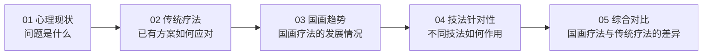

# 「笔墨通心」中国画美育疗法数据可视化平台设计文档

## 1. 文档说明

### 1.1 项目定位

本项目为纯前端数据可视化展示页面，围绕大学生常见心理问题、传统心理疗法、中国画美育疗法的发展趋势、中国画技法的针对性，以及中国画疗法与传统疗法的综合对比展开。

页面主要面向 `1920 × 1080` 大屏展示。交互逻辑使用原生 JavaScript 实现，图表统一使用 ECharts 绘制。当前版本已经接入 `realdata/` 目录中的四份数据表。

### 1.2 核心表达

页面不是普通数据后台，而是具有中国画意境的专题型可视化作品。整体设计应体现：

- **数据清晰**：图表、指标和交互反馈优先保证可读性。
- **国画气质**：借用宣纸、墨色、朱砂、留白、印章和山水层次，而不是简单铺设一张背景图。
- **叙事递进**：从“问题现状”逐步过渡到“传统方法”“国画疗法趋势”“技法机制”“综合对比”。
- **交互克制**：动效柔和、有呼吸感，避免炫技式动画破坏主题。

### 1.3 已确认范围

| 项目 | 说明 |
| --- | --- |
| 页面数量 | 5 页 |
| 交付形式 | Markdown 设计文档 |
| 数据状态 | 已接入 `realdata/` 数据表，页面保留数据来源提示 |
| 图表库 | ECharts |
| 目标屏幕 | 主要适配 `1920 × 1080` |
| 第四页素材 | 使用项目提供的国画图片作为主体视觉 |
| 第三页年份 | `2016-2025`，共 10 个年份节点 |
| 雷达图传统疗法 | CBT 认知行为疗法、正念疗法、运动干预、药物治疗 |

---

## 2. 信息架构

### 2.1 页面导航

顶部导航固定为五项，当前页使用朱砂红底色强调：

| 编号 | 导航名称 | 页面标题 |
| --- | --- | --- |
| `01` | 心理现状 | 大学生心理问题现状总览 |
| `02` | 传统疗法 | 传统心理疗法优缺点分析 |
| `03` | 国画趋势 | 中国画美育疗法趋势 |
| `04` | 技法针对性 | 中国画技法对于每种心理问题的针对性 |
| `05` | 综合对比 | 中国画疗法与传统疗法综合对比 |

### 2.2 页面叙事



---

## 3. 整体视觉系统

### 3.1 视觉关键词

`宣纸留白`、`水墨晕染`、`朱砂印章`、`淡雅设色`、`古今融合`、`温和可信`

参考图片的画面特点包括远山、瀑布、溪流、桥、亭台、人物、花鸟和大面积留白。页面应借鉴这种空间层次：

- 页面背景如宣纸，保持温润米白。
- 边缘使用低透明度山水或纸纹，不干扰图表。
- 卡片如半透明册页，边框轻薄。
- 重点数据和选中状态使用朱砂红。
- 正文及图表轴线使用墨色和灰墨色。

### 3.2 色彩规范

| 角色 | 色值 | 用途 |
| --- | --- | --- |
| 宣纸底色 | `#F5F0E6` | 页面主背景 |
| 卡片底色 | `rgba(255, 253, 247, 0.82)` | 图表卡片、浮层 |
| 墨色主文字 | `#25312F` | 标题、重点正文 |
| 灰墨辅助文字 | `#68736F` | 注释、轴标签、说明 |
| 朱砂红 | `#BE4538` | 当前导航、核心折线、按钮、强调 |
| 朱砂浅色 | `#E6B8AE` | 填充、描边、悬停背景 |
| 松石绿 | `#41846F` | 焦虑之外的分类色、辅助图表 |
| 靛青蓝 | `#4869B2` | 传统疗法雷达图、辅助图表 |
| 藤黄 | `#CA922D` | 学习压力、提醒型数据 |
| 黛紫 | `#705AA5` | 自我否认分类 |
| 节点灰 | `#888B89` | 第三页年份节点外圈 |

### 3.3 四类心理问题固定配色

五个页面中，只要出现四类心理问题，均保持统一颜色：

| 心理问题 | 颜色 | 色值 |
| --- | --- | --- |
| 焦虑 | 朱砂红 | `#BE4538` |
| 抑郁 | 松石绿 | `#41846F` |
| 自我否认 | 黛紫 | `#705AA5` |
| 学习压力 | 藤黄 | `#CA922D` |

### 3.4 字体建议

| 场景 | 建议字体 | 字号 |
| --- | --- | --- |
| 品牌名、页面主标题 | `STKaiti`, `KaiTi`, serif | `42-52px` |
| 模块标题 | `"Microsoft YaHei"`, sans-serif | `24-30px` |
| 正文 | `"Microsoft YaHei"`, sans-serif | `16-20px` |
| 指标数字 | `DIN Alternate`, `"Arial Narrow"`, sans-serif | `36-48px` |
| 图表标签 | `"Microsoft YaHei"`, sans-serif | `14-18px` |

标题可适量使用楷体体现文化气质。数据与较长正文使用现代无衬线字体，避免可读性下降。

### 3.5 通用布局

- 画布基准：`1920 × 1080`。
- 页面内边距：左右 `28px`，顶部 `24px`，底部 `24px`。
- 顶栏高度：约 `100px`。
- 内容区域：使用 CSS Grid 或 Flex 布局。
- 卡片圆角：`10-14px`。
- 卡片边框：`1px solid rgba(85, 76, 60, 0.14)`。
- 卡片阴影：`0 12px 36px rgba(62, 51, 35, 0.08)`。
- 背景纸纹透明度控制在 `4%-10%`，避免影响文字和图表。

### 3.6 通用动效

| 交互 | 动效 |
| --- | --- |
| 页面切换 | 内容区域淡入并轻微上移，时长 `300-450ms` |
| 卡片悬停 | 阴影增强，向上移动 `2px` |
| 按钮切换 | 朱砂浅色背景渐变，时长 `180-240ms` |
| 图表更新 | ECharts 更新动画 `500-800ms` |
| 弹窗出现 | 透明度变化配合 `scale(0.98 → 1)` |
| 国画热区悬停 | 白色轮廓渐显，时长 `180-260ms` |

---

## 4. 公共页面框架

### 4.1 顶部品牌区

左侧保留原型中的品牌结构：

- 印章式方框：`笔墨`
- 小字：`画完就跑小组`
- 主品牌：`笔墨通心`
- 副标题：`中国画美育疗法数据可视化平台`

右侧为五项导航。导航应保持单行展示，每项包含两位编号与名称。

### 4.2 数据来源标识

每一页右上角显示：

> 数据来源：项目 realdata 数据表

样式采用浅米色标签和朱砂红小圆点，视觉存在感适中。

---

## 5. 页面一：大学生心理问题现状总览

### 5.1 页面目标

展示四类大学生心理问题的患病率、变化趋势和简要拆解。四类问题可能同时出现在同一学生身上，因此患病率不做合计。读者应在一屏内理解“哪些问题常见、变化如何、诱因是什么”。

### 5.2 布局结构

采用“左侧患病率 + 右侧趋势 + 底部拆解卡片”的结构：

| 区域 | 宽度建议 | 内容 |
| --- | --- | --- |
| 左侧 | `36%` | 2025 年四类心理问题患病率横向条形图 |
| 右侧 | `64%` | 四条趋势折线同图展示 |
| 底部 | 全宽 | 四类心理问题拆解卡片 |

### 5.3 左侧患病率条形图

横向条形图展示 `2025` 年四类心理问题患病率，配色遵循固定分类色。由于不同问题之间存在交叉重叠，不能使用暗示总和为 `100%` 的环形图。

数据：

| 类别 | 患病率 |
| --- | ---: |
| 焦虑 | `34%` |
| 抑郁 | `37%` |
| 自我否认 | `35%` |
| 学习压力 | `71%` |

交互：

- 鼠标悬停时显示类别和患病率。
- 点击条形时，底部对应拆解卡片增加朱砂红边框。

### 5.4 右侧趋势折线图

四类心理问题使用四条折线在同一张图中展示。按年份展示 `2016-2025` 的人数趋势数据。

图表规范：

- 横轴：年份。
- 纵轴：人数，单位为万人。
- 图例：焦虑、抑郁、自我否认、学习压力。
- 默认全部展示，不需要“全部”按钮。
- 支持点击图例隐藏或显示某条线。
- Tooltip 同时展示同一年的四类数据，便于横向比较。

### 5.5 底部拆解卡片

替换原型中的四个汇总指标。四张卡片分别展示问题定义、主要诱因和关联表现。

| 类别 | 拆解文案 |
| --- | --- |
| 焦虑 | 多由对未来不确定性、完美主义引发，表现为心神紧绷、思虑过度、回避困难。长期紧绷易导致失眠与走神，是大学生常见的前置心理问题。 |
| 抑郁 | 长期负面情绪无法疏导所致，常见表现为心境持续低落、丧失兴趣、行动力锐减和习惯性悲观，是压力日积月累后的重度情绪表现。 |
| 自我否认 | 长期横向攀比与负面自我暗示形成，表现为过度贬低自身价值、怯于表现和畏惧竞争，是焦虑与抑郁可能出现的底层心理因素。 |
| 学习压力 | 学业目标过载、竞争环境和功利化求学心态叠加，可能出现厌学畏考、学习效率下滑，也是诱发其他心理问题的重要外部因素。 |

交互：

- 点击卡片后，对应折线加粗，其余折线透明度降低到 `35%`。
- 再次点击或点击空白处恢复全部展示。

---

## 6. 页面二：传统心理疗法优缺点分析

### 6.1 页面目标

对四类传统疗法进行对比，并让用户按心理问题查看每种疗法的适用特点、优点和局限性。

本页不展示中国画疗法，不保留“整体平均”选项。

### 6.2 顶部筛选器

心理问题筛选项：

- 焦虑
- 抑郁
- 自我否认
- 学习压力

默认选中“焦虑”。切换心理问题后，柱状图与疗法详情同步更新。

### 6.3 分组柱状图

横轴展示传统疗法：

- CBT 认知行为疗法
- 正念疗法
- 运动干预
- 药物治疗

每种疗法包含三个相邻柱体：

| 指标 | 颜色 | 色值 |
| --- | --- | --- |
| 改善率 | 红 | `#BE4538` |
| 情绪效价提升 | 绿 | `#41846F` |
| 满意度 | 蓝 | `#4869B2` |

图表规范：

- 纵轴：`0%-100%`。
- 每根柱体顶部显示数值。
- Tooltip 展示疗法名、当前心理问题和三个指标。
- 切换心理问题后，柱状图使用更新动画。
- 疗法名称字号提高到 `18-20px`，字重设为 `600`。

### 6.4 疗法详情入口

每种疗法名称下方放置圆形信息按钮：

- 默认：墨色描边圆形，内含 `i` 或 `详`。
- 悬停：边框和文字变为朱砂红。
- 点击：打开详情弹窗。

### 6.5 疗法详情弹窗

弹窗内容：

| 区域 | 内容 |
| --- | --- |
| 标题 | 疗法名称 |
| 标签 | 当前选中的心理问题 |
| 简介 | 疗法的基础介绍 |
| 优点 | 针对当前心理问题的优势 |
| 局限 | 针对当前心理问题的不足 |
| 数据摘要 | 改善率、情绪效价提升、满意度 |

弹窗宽度建议 `620-720px`。背景可加入低透明度竹叶或水墨纹理。

---

## 7. 页面三：中国画美育疗法趋势

### 7.1 页面目标

展示中国画美育疗法从 `2016` 年至 `2025` 年的参与人数和满意度变化。页面只保留两个核心统计维度：参与人数和满意度。

### 7.2 顶部指标卡片

建议保留两张卡片：

| 指标 | 内容 |
| --- | --- |
| 累计参与人数 | `2016-2025` 年参与人数总和 |
| 最新满意度 | `2025` 年满意度 |

每张卡片带有简短说明，页面右上角显示 `realdata` 数据来源标签。

### 7.3 年份趋势可视化

主体使用折线连接十个年份节点：

`2016`、`2017`、`2018`、`2019`、`2020`、`2021`、`2022`、`2023`、`2024`、`2025`

节点视觉：

- 外圈：灰色圆形，代表参与人数。
- 外圈半径：根据参与人数映射，建议范围 `42-66px`。
- 内圈：直径略小的红色饼图，代表满意度。
- 未达到 `100%` 的部分保留为透明或米白缺口。
- 节点右侧显示满意度，例如 `87%`。
- 节点下方显示年份与参与人数，例如 `2021 / 3,650 人`。
- 节点之间以细朱砂红折线连接。

交互：

- 悬停节点时，外圈轻微放大。
- Tooltip 展示年份、参与人数、满意度。
- 点击节点后，右侧或下方详情栏显示该年份摘要。

### 7.4 ECharts 实现建议

本图可使用组合方案：

- 折线：`series.type = "line"`。
- 外圈节点：`series.type = "scatter"`，以参与人数映射 `symbolSize`。
- 满意度内圈：使用 `custom series` 绘制圆形饼图缺口，或在节点位置叠加独立饼图。

若独立饼图数量较多导致布局复杂，优先采用 `custom series`，以 Canvas 路径绘制红色扇形和灰色底圆。

---

## 8. 页面四：中国画技法对于每种心理问题的针对性

### 8.1 页面目标

以完整国画作为互动主体，让用户通过悬停和点击画面中的四个区域，理解不同国画技法与四类心理问题之间的对应关系。

### 8.2 主体图片

使用项目素材：

`6AC7416D28C9568B2FDC3A7368A60A26.jpg`

图片铺设在主体卡片内，保持完整构图。图片周围保留宣纸式留白，不进行过度裁切。

### 8.3 热区配置

热区应使用与图片等比例缩放的 SVG 覆盖层实现。不要使用固定像素坐标。SVG 设置统一 `viewBox`，内部使用 `path` 或 `polygon` 描述区域。

| 热区 | 对应心理问题 | 推荐区域 | 技法 |
| --- | --- | --- | --- |
| `inkLandscape` | 抑郁 | 画面上方远山、瀑布与水墨山体 | 泼墨山水 |
| `lineDrawing` | 焦虑 | 画面中右部亭台、人物、柳树附近 | 工笔白描 |
| `freehandBirdFlower` | 自我否认 | 画面右侧花鸟与设色植物 | 写意花鸟 |
| `lightColorLandscape` | 学习压力 | 画面左下溪流、桥、山石与开阔水面 | 浅绛山水 |

### 8.4 热区状态

| 状态 | 视觉表现 |
| --- | --- |
| 默认 | 热区透明，不显示轮廓 |
| 悬停 | 显示 `2-3px` 白色描边和轻微白色外发光 |
| 选中 | 保留白色描边，出现朱砂红印章式标签 |
| 弹窗打开 | 未选区域略微降低亮度，突出当前区域 |

### 8.5 点击弹窗文案

#### 工笔白描：对应焦虑

**心理学干预原理：正念聚焦与行为抑制**

焦虑常表现为思绪失控与对未来不确定性的担忧。工笔白描强调稳定、细致和身体控制。绘制长线时，需要集中注意力并控制手部动作，这种专注过程有助于暂时中断反复思虑，使体验者将注意力拉回当下，并获得可感知的掌控感。

#### 泼墨山水：对应抑郁

**心理学干预原理：情感宣泄与打破防御**

抑郁状态常伴随情感压抑和动力下降。写意与泼墨需要调动较大的身体动作，墨色在宣纸上自然晕染和碰撞。创作中的不可完全控制性提供了相对开放的表达空间，使体验者通过墨色变化释放压抑情绪。

#### 写意花鸟：对应自我否认

**心理学干预原理：接纳不完美与认知重构**

自我否认常与过度比较、害怕犯错和完美主义倾向相关。写意画不追求机械式复刻，多一笔、少一笔或颜色自然溢出，都可能形成新的画面趣味。体验者可以借此练习容忍模糊性，理解不完美也具有独特价值。

#### 浅绛山水：对应学习压力

**心理学干预原理：注意力恢复与空间拓展**

持续学习压力可能造成注意力疲劳，并压缩心理空间。浅绛山水通过自然色彩、远近层次、留白和开阔构图，形成舒缓的视觉体验。画面中的空间延展感有助于体验者暂时从紧绷状态中抽离。

### 8.6 技术结构示意

```html
<div class="painting-stage">
  
  <svg class="painting-hotspots" viewBox="0 0 1408 768">
    <path data-hotspot="inkLandscape" />
    <path data-hotspot="lineDrawing" />
    <path data-hotspot="freehandBirdFlower" />
    <path data-hotspot="lightColorLandscape" />
  </svg>
</div>
```

---

## 9. 页面五：中国画疗法与传统疗法综合对比

### 9.1 页面目标

固定展示中国画疗法，以红色雷达图表示；用户从四种传统疗法中选择一种，以蓝色雷达图叠加对比。

### 9.2 页面布局

| 区域 | 宽度建议 | 内容 |
| --- | --- | --- |
| 左侧 | `70%` | 雷达图与疗法选择器 |
| 右侧 | `30%` | 当前对比摘要、五个维度解释 |

### 9.3 疗法选择器

选择器只展示传统疗法：

- CBT 认知行为疗法
- 正念疗法
- 运动干预
- 药物治疗

默认选中 CBT 认知行为疗法。

中国画疗法始终显示，无需单独选择。

### 9.4 雷达图维度

| 维度 | 中心含义 | 边缘含义 | 展示方式 |
| --- | --- | --- | --- |
| 改善占比 | 低 | 高 | `0%-100%` |
| 起效周期长短 | 长 | 短 | 越靠外表示起效越快 |
| 用户接受率 | 低 | 高 | `0%-100%` |
| 风险安全性 | 风险较高 | 更安全 | 越靠外表示风险越低 |
| 方案成本 | 高 | 低 | 越靠外表示成本越低 |

为了让雷达面积越大始终表示综合表现越优，起效周期、风险安全性和方案成本需在数据层进行正向归一化。

### 9.5 雷达图视觉规范

| 对象 | 颜色 | 线条 | 填充 |
| --- | --- | --- | --- |
| 中国画疗法 | `#BE4538` | `3px` 实线 | `rgba(190, 69, 56, 0.18)` |
| 传统疗法 | `#4869B2` | `3px` 实线 | `rgba(72, 105, 178, 0.14)` |

每个轴的标题旁标注方向，例如：

- `改善占比：0% → 100%`
- `起效周期：长 → 短`
- `用户接受率：0% → 100%`
- `风险安全性：风险较高 → 更安全`
- `方案成本：高 → 低`

### 9.6 右侧对比摘要

右侧卡片动态展示：

- 当前传统疗法名称
- 中国画疗法相对优势
- 当前传统疗法相对优势
- 五个维度的数值列表

切换传统疗法时，只更新蓝色雷达图和摘要，红色中国画雷达图保持不变。

---

## 10. 数据来源与映射

### 10.1 原始数据文件

| 文件 | 页面用途 |
| --- | --- |
| `realdata/心理问题人数及患病率.xlsx` | 页面一：四类问题患病率和 `2016-2025` 人数趋势 |
| `realdata/经典四种心理疗法细分交叉统计表.xlsx` | 页面二：四种传统疗法的改善率、情绪效价提升度和满意度 |
| `realdata/2015-2025全国大学生中国画美育疗法数据趋势表.xlsx` | 页面三：国画美育疗法参与人数、满意度、情绪效价提升度和发展阶段 |
| `realdata/五大疗法与四类心理问题独立细分矩阵表.xlsx` | 页面五：中国画与四种传统疗法综合对比 |

页面四的国画热区、技法说明和心理机制沿用需求文档中的策划内容。

### 10.2 数据口径说明

- 页面一使用 `2016-2025` 十年数据。患病率允许交叉重叠，不做合计。
- 页面二展示改善率、满意度和情绪效价指数。为便于三组柱体在同一图中比较，情绪效价指数使用 `效应量 d × 100`。
- 页面三遵循页面设计要求，仅展示 `2016-2025` 十个节点。工作簿中 `2015` 年数据保留在原始文件中，但不进入页面节点。
- 国画趋势工作簿注明，全国层面的垂直统计基于高校实践案例、部分公开研究样本和文献发展趋势进行综合推演与均值建模，并非单一官方发布口径。
- 页面五的改善占比和用户接受率取五大疗法矩阵中四类心理问题的平均值。
- 页面五的起效周期、安全性和方案成本来自定性字段的正向归一化结果。越靠近雷达边缘代表起效更快、安全性更高、成本更低。

### 10.3 数据文件结构

```text
src/data/
  shared.js             # 分类色与数据来源提示
  mental-status.js      # 页面一数据
  therapies.js          # 页面二数据
  painting.js           # 页面三趋势与页面四热区
  radar-comparison.js   # 页面五归一化结果
  mock-data.js          # 兼容性统一导出入口
```

### 10.4 雷达图归一化记录

| 疗法 | 改善占比 | 起效速度 | 用户接受率 | 风险安全性 | 成本优势 |
| --- | ---: | ---: | ---: | ---: | ---: |
| 中国画美育疗法 | `58.3` | `58` | `90.3` | `98` | `98` |
| CBT 认知行为疗法 | `65` | `72` | `77.3` | `82` | `48` |
| 正念疗法 | `60.5` | `66` | `85.8` | `94` | `82` |
| 运动干预 | `55.3` | `88` | `81.3` | `78` | `98` |
| 药物治疗 | `45.8` | `54` | `39.5` | `45` | `58` |

---
## 12. JavaScript 交互状态设计

### 12.1 全局状态

```js
const state = {
  activePage: "mentalStatus",
  selectedProblem: "anxiety",
  selectedTraditionalTherapy: "cbt",
  selectedPaintingHotspot: null,
  activeModal: null
};
```

### 12.2 核心事件

| 事件 | 触发方式 | 行为 |
| --- | --- | --- |
| `NAVIGATE_PAGE` | 点击顶部导航 | 切换当前页面并触发淡入动画 |
| `SELECT_PROBLEM` | 点击心理问题筛选项 | 更新页面一高亮或页面二柱状图 |
| `OPEN_THERAPY_MODAL` | 点击疗法圆形按钮 | 打开传统疗法详情弹窗 |
| `HOVER_PAINTING_HOTSPOT` | 悬停国画区域 | 显示白色描边 |
| `OPEN_PAINTING_MODAL` | 点击国画区域 | 打开技法说明弹窗 |
| `SELECT_TRADITIONAL_THERAPY` | 点击疗法选择器 | 更新页面五蓝色雷达图和摘要 |
| `CLOSE_MODAL` | 点击关闭、遮罩或按下 `Esc` | 关闭弹窗 |

### 12.3 组件拆分建议

```text
App
├── HeaderBrand
├── TopNavigation
├── MockDataBadge
├── MentalStatusPage
│   ├── DistributionDonut
│   ├── ProblemTrendLines
│   └── ProblemAnalysisCards
├── TraditionalTherapyPage
│   ├── ProblemTabs
│   ├── GroupedBarChart
│   └── TherapyDetailModal
├── PaintingTrendPage
│   ├── TrendSummaryCards
│   └── YearNodeTrendChart
├── PaintingTechniquePage
│   ├── PaintingStage
│   ├── SvgHotspotLayer
│   └── TechniqueDetailModal
└── ComparisonPage
    ├── TherapySelector
    ├── RadarComparisonChart
    └── ComparisonSummary
```

---

## 13. 响应式与兼容策略

虽然页面主要面向 `1920 × 1080`，仍建议保留基础缩放能力：

- 根容器按 `1920 × 1080` 设计。
- 对低于目标尺寸的屏幕，可使用 CSS `transform: scale()` 等比例缩放整屏内容。
- 最低建议展示尺寸：`1366 × 768`。
- 第四页 SVG 热区必须跟随图片等比例缩放。
- 浏览器窗口变化时，对所有 ECharts 实例执行 `chart.resize()`。

---

## 14. 验收清单

### 14.1 视觉验收

- [ ] 五个页面的导航名称、编号和选中状态一致。
- [ ] 页面具有宣纸、水墨、朱砂和留白气质，但不影响图表阅读。
- [ ] 四类心理问题在所有页面使用固定配色。
- [ ] 所有页面均展示 realdata 数据来源标签。
- [ ] 卡片、按钮、弹窗和 Tooltip 风格统一。

### 14.2 页面验收

- [ ] 页面一将四类趋势折线合并至同一图表。
- [ ] 页面一底部展示四类心理问题拆解卡片。
- [ ] 页面二移除中国画疗法和整体平均选项。
- [ ] 页面二每种传统疗法包含三个相邻柱体。
- [ ] 页面二支持按心理问题筛选，并支持打开疗法详情。
- [ ] 页面三仅展示参与人数和满意度。
- [ ] 页面三年份为 `2016-2025`，共 10 个节点。
- [ ] 页面三节点由灰色人数外圈与红色满意度扇形内圈组成。
- [ ] 页面四使用完整国画图片，并配置四个 SVG 热区。
- [ ] 页面四热区悬停出现白色描边，点击打开技法弹窗。
- [ ] 页面五中国画疗法始终以红色雷达图显示。
- [ ] 页面五可选择四种传统疗法之一，并以蓝色雷达图叠加对比。
- [ ] 页面五五项雷达指标方向正确，越靠外均代表综合表现越优。

### 14.3 技术验收

- [ ] 所有 ECharts 图表在窗口尺寸变化后正确重绘。
- [ ] SVG 热区与背景图片在缩放后仍准确对齐。
- [ ] 弹窗支持点击关闭按钮、遮罩和按下 `Esc` 关闭。
- [ ] 图表数据与 UI 文案从独立数据文件读取。
- [ ] 数据模块与页面组件保持分离，后续调整数据时无需修改组件业务逻辑。

